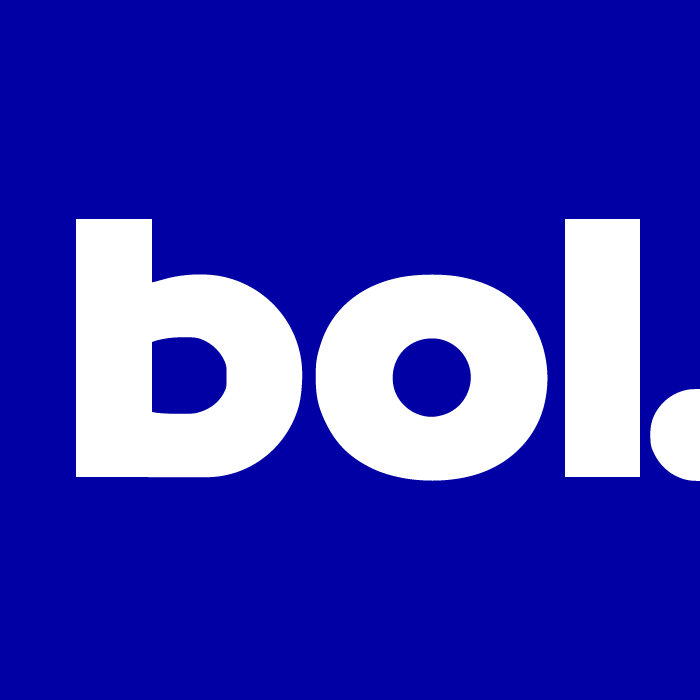

<!-- PROJECT SHIELDS -->
<!--
*** I'm using markdown "reference style" links for readability.
*** Reference links are enclosed in brackets [ ] instead of parentheses ( ).
*** See the bottom of this document for the declaration of the reference variables
*** for contributors-url, forks-url, etc. This is an optional, concise syntax you may use.
*** https://www.markdownguide.org/basic-syntax/#reference-style-links
-->
[![Contributors][contributors-shield]][contributors-url]
[![Forks][forks-shield]][forks-url]
[![Stargazers][stars-shield]][stars-url]
[![Issues][issues-shield]][issues-url]
[![MIT License][license-shield]][license-url]
[![LinkedIn][linkedin-shield]][linkedin-url]

<!-- PROJECT LOGO -->
<br />
<p align="center">
    <a href="https://github.com/rohitjethoe/nodejs-bol-wrapper">
        
    </a>
    <h3 align="center">nodejs-bol-wrapper</h3>
    <p align="center">
        Bol.com API Node.js Wrapper
        <br />
        <a href="https://github.com/rohitjethoe/nodejs-bol-wrapper"><strong>Explore the docs »</strong></a>
        <br />
        <br />
        <a href="https://github.com/rohitjethoe/nodejs-bol-wrapper">View Site</a>
        ·
        <a href="https://github.com/rohitjethoe/nodejs-bol-wrapper/issues">Report Bug</a>
        ·
        <a href="https://github.com/rohitjethoe/nodejs-bol-wrapper/issues">Request Feature</a>
    </p>
</p>

<!-- TABLE OF CONTENTS -->
## Table of Contents
* [About the Project](#about-the-project)
    * [Built With](#built-with)
* [Features](#features)

<!-- ABOUT THE PROJECT -->
## About The Project
A Node.js wrapper for the Bol.com API. Limiting calls for JWT token by using cache.

Feel free fork and edit this project to your liking.

### Built With

* [Node.js](https://nodejs.org/en/)
* [Express](https://expressjs.com/)
* [Node Cache](https://github.com/node-cache/node-cache)
* [Dotenv](https://github.com/motdotla/dotenv)

## Features
v1.0.0
- Caching JWT token and only makes new call to Bol.com API when expired.

### Installation

1. Clone the repo
```sh
git clone https://github.com/rohitjethoe/nodejs-bol-wrapper.git
```
2. Install NPM packages
```sh
npm install
```
or
```sh
npm install
```
2. Load MacOS/Windows Application
```sh
npm run dev
```

<!-- MARKDOWN LINKS & IMAGES -->
<!-- https://www.markdownguide.org/basic-syntax/#reference-style-links -->
[contributors-shield]: https://img.shields.io/github/contributors/rohitjethoe/nodejs-bol-wrapper.svg?style=flat-square
[contributors-url]: https://github.com/mosuswalks/nodejs-bol-wrapper/contributors
[forks-shield]: https://img.shields.io/github/forks/rohitjethoe/nodejs-bol-wrapper.svg?style=flat-square
[forks-url]: https://github.com/rohitjethoe/nodejs-bol-wrapper/network/members
[stars-shield]: https://img.shields.io/github/stars/rohitjethoe/nodejs-bol-wrapper.svg?style=flat-square
[stars-url]: https://github.com/rohitjethoe/nodejs-bol-wrapper/stargazers
[issues-shield]: https://img.shields.io/github/issues/rohitjethoe/nodejs-bol-wrapper.svg?style=flat-square
[issues-url]: https://github.com/rohitjethoe/nodejs-bol-wrapper/issues
[license-shield]: https://img.shields.io/github/license/othneildrew/Best-README-Template.svg?style=flat-square
[license-url]: https://github.com/rohitjethoe/nodejs-bol-wrapper/LICENSE
[linkedin-shield]: https://img.shields.io/badge/-LinkedIn-black.svg?style=flat-square&logo=linkedin&colorB=555
[linkedin-url]: https://linkedin.com/in/rohitjethoe